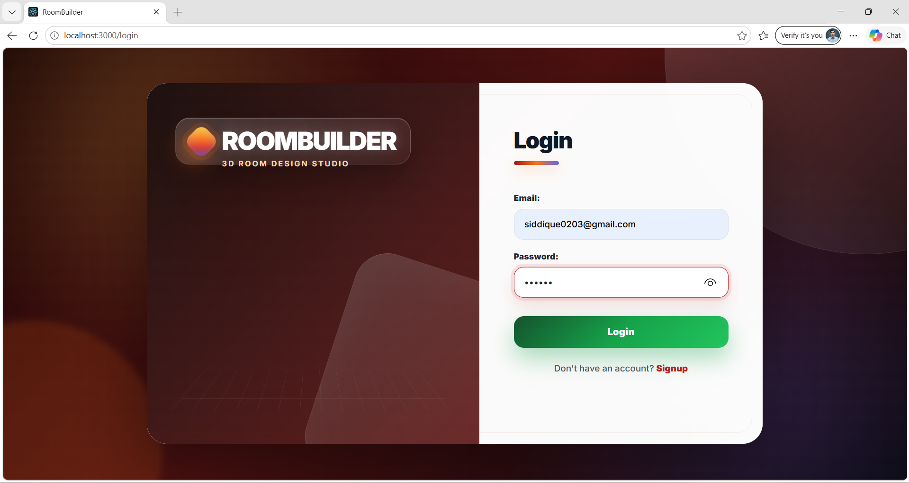
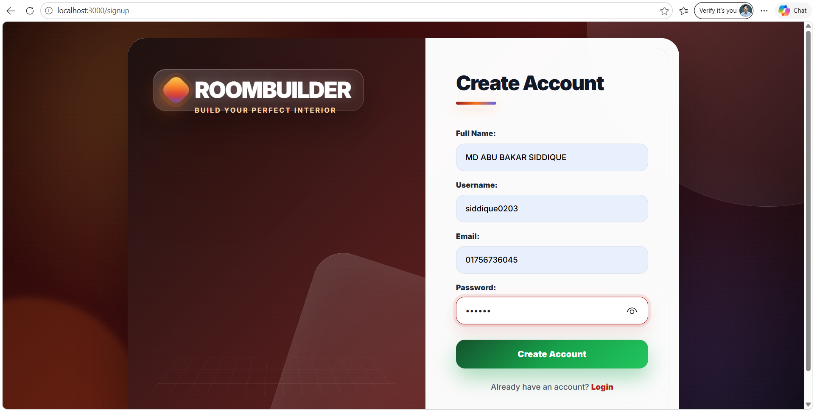
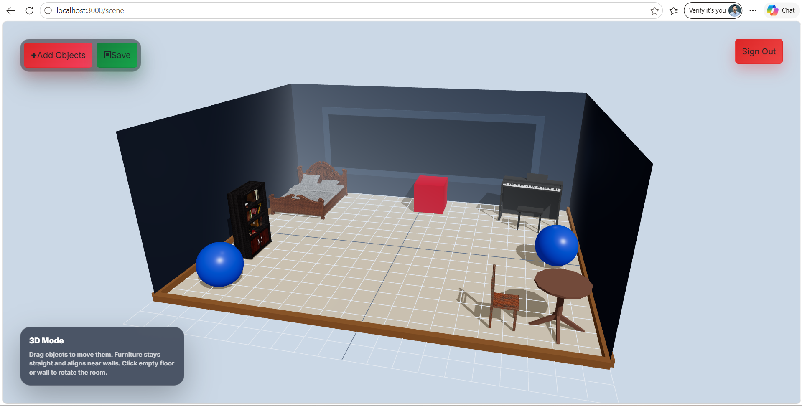
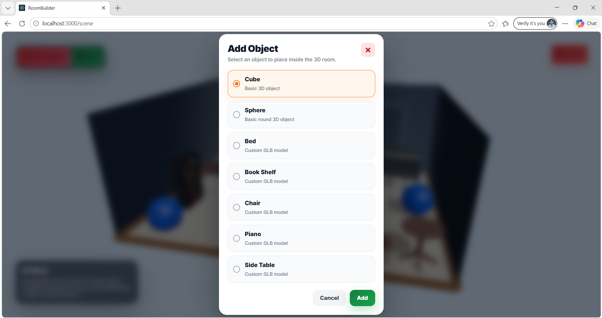
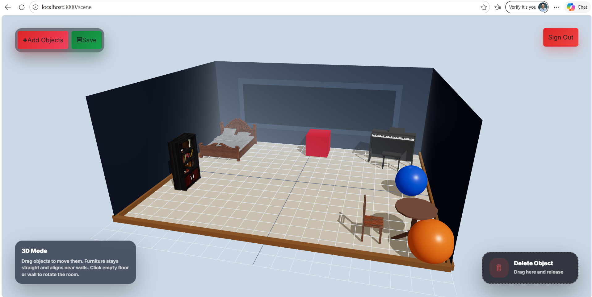

# RoomBuilder

RoomBuilder is a MERN Stack 3D room builder application built for a technical round assignment. The application allows users to sign up, log in, enter a 3D room scene, add objects, move objects inside the scene, remove objects, and save/load scene data using MongoDB.

## Features

* User signup and login
* Session-based authentication
* Protected 3D scene page
* Add 3D objects to the room
* Add the same object multiple times
* Drag and move objects inside the scene
* Remove objects from the scene
* Save object positions to MongoDB
* Load previously saved scene data after login
* Responsive UI for desktop and mobile views

## Tech Stack

### Frontend

* React
* Three.js
* React Three Fiber
* CSS

### Backend

* Node.js
* Express.js
* MongoDB
* Mongoose
* Express Session
* Dotenv

## Project Structure

```bash
RoomBuilder/
├── client/
│   ├── public/
│   ├── src/
│   ├── package.json
│   └── package-lock.json
├── server/
│   ├── controllers/
│   ├── middleware/
│   ├── model/
│   ├── routes/
│   ├── index.js
│   ├── package.json
│   └── package-lock.json
├── Screenshots/
├── .gitignore
└── README.md
```

## Screenshots

### Login Page



### Signup Page



### Scene Page



### Add Object Modal



### Remove Object



## Run Locally

### 1. Clone the Repository

```bash
git clone https://github.com/siddique0203/RoomBuilder.git
cd RoomBuilder
```

### 2. Install Server Dependencies

```bash
cd server
npm install
```

### 3. Create Server Environment File

Create a `.env` file inside the `server` folder:

```env
MONGO_URI=your_mongodb_connection_string
SESSION_SECRET=your_session_secret
PORT=8000
```

### 4. Run the Backend Server

```bash
npm run dev
```

The backend server should run on:

```bash
http://localhost:8000
```

### 5. Install Client Dependencies

Open a new terminal:

```bash
cd client
npm install
```

### 6. Run the React Client

```bash
npm start
```

The frontend should run on:

```bash
http://localhost:3000
```

## Environment Variables

The backend requires the following environment variables:

| Variable         | Description                     |
| ---------------- | ------------------------------- |
| `MONGO_URI`      | MongoDB connection string       |
| `SESSION_SECRET` | Secret key for session handling |
| `PORT`           | Backend server port             |

## Challenges Faced

* Setting up MongoDB connection and handling connection errors
* Implementing session-based authentication
* Managing frontend and backend folder structure
* Adding and moving objects inside a 3D scene
* Saving object position data in MongoDB
* Loading saved scene data after user login
* Managing Git and GitHub project upload correctly

## What I Learned

* Building a MERN stack project with separate frontend and backend folders
* Using Three.js / React Three Fiber for 3D web development
* Creating and managing user authentication with sessions
* Saving and loading structured scene data with MongoDB
* Using Git and GitHub for version control
* Organizing project files, screenshots, and documentation

## AI Tool Usage

AI tools were used for guidance in debugging, Git/GitHub workflow, README formatting, and improving project documentation. The project implementation, file setup, testing, and final code changes were handled manually.

## Completion Status

Estimated completion: 85%

Completed:

* Signup and login
* Session-based user tracking
* 3D scene page
* Add object feature
* Move object feature
* Remove object feature
* Save/load scene data
* GitHub repository setup
* Screenshots and documentation

Not completed:

* Live hosting/deployment
* Advanced object customization
* Extra visual effects while dragging objects

## Repository Link

https://github.com/siddique0203/RoomBuilder
